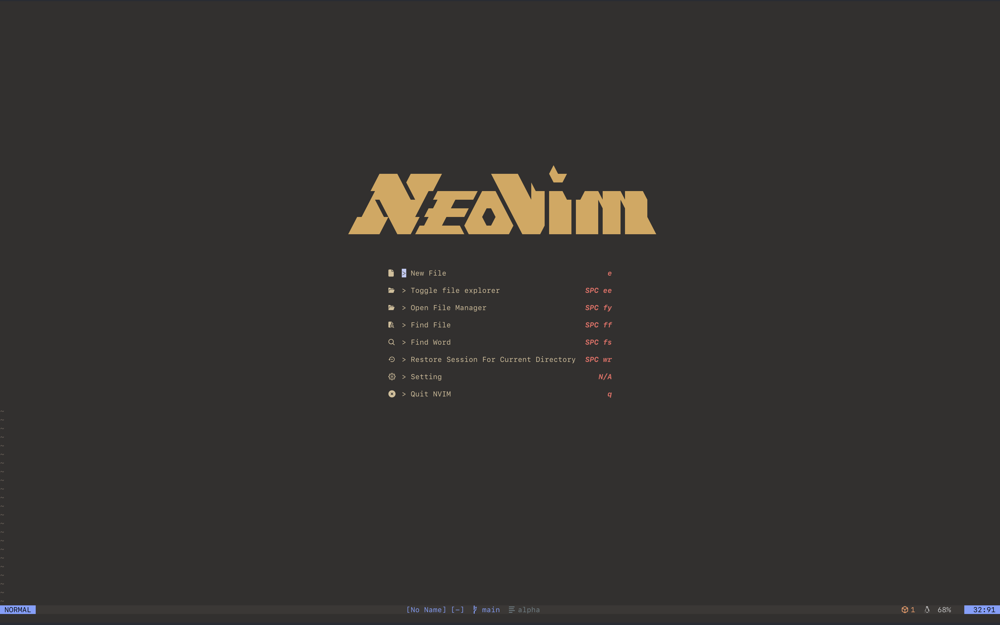

# Neovim

this is my personal all-in-one setup

# HOW TO INSTALL AND USE MY CONFIGURATION

you can download using `git clone https://github.com/izzyswe/Neovim-config.git`
or download it as zip

1. go to your terminal, type `cd ~/.config`
2. paste the zip folder in the `~/.config`
3. unzip it
4. go back to the terminal and type `nvim` into whatever folder you want to work on
5. should download and load all mason and LazyVim configurations
6. happy coding!

## INCLUDED LSP
- PHP
- Java (must install gradle to properly make java projects)
- Python
- Golang
- Lua
- Typsecript
- graphql
- css / tailwind css
- html
- prismal
- harper
- emmet

## INCLUDED PLUGINS
- `lazy.nvim`
- `Mason.nvim`
- `lspconfig.nvim`
- `alpha.nvim`
- `autopairs.nvim`
- `autosave.nvim`
- `bufferline.nvim`
- `colourscheme.nvim`
- `dressing.nvim`
- `indent-blankline.nvim`
- `live-server.nvim`
- `lualine.nvim`
- `smoothscroller.nvim`
- `nvim-cmp.nvim`
- `nvim-tree.nvim`
- `subsitute.nvim`
- `telescope.nvim`
- `toggleterm.nvim`
- `treesitter.nvim`
- `vim-maximizer.nvim`
- `which-key.nvim`
- `tmux.nvim`
- `gemini.nvim`
- `claude-code.nvim`
- `yazi.nvim`

Keybinds will be uploaded soon.

## Neovim Configuration Resources  
https://neovim.io/doc/  
https://www.lazyvim.org/configuration/plugins  
https://github.com/williamboman/mason-lspconfig.nvim  
